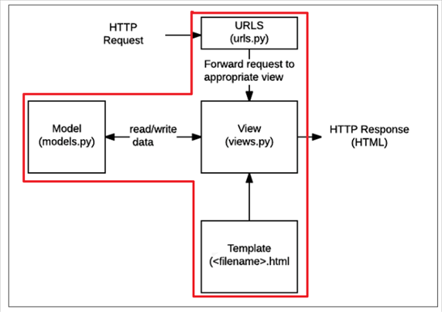

# Django

- Python 기반, 웹 프레임워크

## Django 시작 과정

- 프로젝트 생성
    `django-admin startproject <projectname> <dir>`  

- 현재 폴더에 생성
    `django-admin startproject <projectname> .`  

- 개발 서버 실행(폴더 안쪽 이동)
    `cd <projectname>`  
    `python manage.py runserver`  

    1. settings.py : 프로젝트 설정 관리
    2. urls.py : 어떤 요청 처리할지 결정
    3. init.py : 하나의 폴더를 하나의 파이썬 패키지로 인식하도록 하는 파일(호환성. 구버전에서도 동작하도록)
    4. wsgi.py : 웹 서버 관련 설정
    5. manage.py :  Django 프로젝트 유틸리티(조종기)

## APP

### App 생성하기

`python manage.py startapp <app name>`  

- Project : 어플리케이션의 집합체
- App : 각각의 기능 단위 모듈

### App 등록하기

- `settings.py`의 `INSTALLED_APPS` 부분에 생성한 앱을 적어 등록.

1. admin.py : 관리자용 페이지 관련 설정
2. apps.py : 앱 관련 정보 설정
3. models.py : DB관련 데이터 정의 파일
4. test.py : 테스트 관련 파일
5. views.py : 요청을 처리하고 처리한 결과를 반환하는 파일

## Client, Server

- Clinet : 인터넷에 연결된 장치, 웹 브라우저를 말함 -> 서비스를 요청하는 주체(사용자)
- Server : 자원을 가지고 있는 컴퓨터, 요청을 처리하고 응답하는 주체.

- 구글 사이트에 접속한다는 것

    1. google.html 파일 요청
    2. 구글 서버가 요청을 받아서 google.html 파일을 우리 컴퓨터에 전달
    3. 우리 컴퓨터의 웹 브라우저가 google.html 파일을 해석해 보여줌

## 요청과 응답

### 웹 브라우저, 웹 페이지

- 웹 브라우저 : 내가 원하는 페이지를 찾아서 보여주고 하이퍼링크를 통해 다른 페이지로 이동할 수 있도록 도와주는 프로그램. HTML 파일을 우리가 보는 화면으로 바꾸는 프로그램(렌더링)
- 웹 페이지 : 우리가 보는 모든 화면 하나하나.

#### 정적, 동적 웹페이지

1. 정적 웹페이지(Static)
    - 작성한 상태 그대로 제공
    - 모든 상황에서 동일한 내용 전달
    - 우리가 작성한 HTML

2. 동적 웹페이지(Dynamic)
    - 요청에 따라 보여주는 모습이 달라지는 웹 페이지
    - 포털 사이트에 A유저가 로그인했을 때, B유저가 로그인했을 때 화면이 다름.
    - 요청을 받아서 적절한 응답을 만들어주는 주체가 필요(Django)

### 프론트엔드, 백엔드

1. 백엔드
    - 보이지 않는 서버 측의 작업 담당
    - DB 상호작용, 비즈니스 로직 처리, 보안, 사용자 인증 등
    - 사용자가 요청한 데이터 처리하고 그 결과 생성
    - 서버 사이드 언어 및 프레임워크 사용해 개발, DB와의 통신을 담당
    - 안정성, 보안성, 성능을 유지하며 프론트엔드와의 원활한 데이터 교환 지원

2. 프론트엔드
    - 디자이너의 웹 페이지 기반으로 동적이고 상호작용적인 웹 애플리케이션 개발
    - 주로 자바스크립트 프레임워크나 라이브러리 사용. 데이터 처리와 상태 관리 담당.
    - 백엔드와의 통신을 위한 API 요청 및 응답 처리, 데이터의 가공 및 표시, 사용자 입력에 대한 반응 등 담당.
    - 웹 애플리케이션의 비즈니스 로직과 상호작용적인 요소를 다루며, UI 컴포넌트의 상태 관리와 라우팅 등 수행.
    - 웹 퍼블리셔와 협업해, 웹 어플의 전체적인 아키텍처와 성능 고려.

### 요청, 응답

1. 요청(Request)
    - 클라이언트가 서버에게 특정한 작업을 요청.
    - 클라의 정보, 요청의 형식, 인증 정보 등을 포함.
    - 데이터를 포함하며, JSON, HTML 폼 데이터와 같은 형식으로 전달.
    - 클라이언트가 요청하는 것이 무엇인지 URL을 보면 파악 가능.

2. 응답(Response)
    - 서버가 클라의 요청을 받고 처리한 후에 클라에게 결과를 전송.
    - 결과에는 여러 부가 정보 포함.
    - HTML, JSON, XML 등의 형식, 클라가 요청한 작업에 따라 다양한 형태로 전송.

## Django의 디자인 패턴

- 디자인 패턴 필요 이유 :
    특정 구조에 대한 설계를 빠르게 할 수 있고, 공통적 발생 문제에 재사용 가능한 해결 방법을 제시 가능.

- Django의 설계 철학은 MVC를 변형한 MTV 패턴.

- MTV는 Model, Template, View. MVC의 View를 Template, Controller를 View가 수행.

### MTV Pattern

1. Model
    - MVC에서의 Model
    - 데이터와 관련된 로직 처리 -> 데이터 구조 정의, DB 기록 관리.

2. Template
    - MVC에서의 View
    - 레이아웃과 화면상의 로직 처리 -> UI, 레이아웃

3. View
    - MVC의 Controller
    - 메인 비즈니스 로직 담당
    - 클라의 요청에 대해 처리를 분기하는 역할
        - DB 조회, 외부로 요청하기도 함
        - 응답을 만들어서 클라에게 전달

### 요청, 응답 과정

1. 요청(request)이 들어오면

2. URL(urls.py) 처리

3. View(views.py) 처리

4. Template(html) 처리

5. 응답(Resonse) 전달

  
