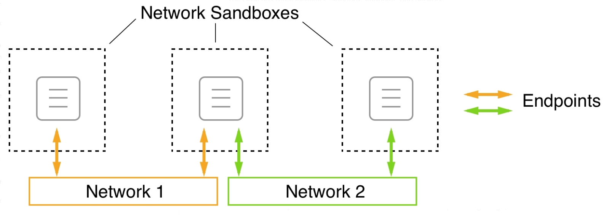

# Docker, CI/CD - 4

## Docker Volume

- Docker Container를 실행하면서 데이터를 보존.

### Volume 사용 이유

- 데이터 영속성 : Container는 쓰고 나면 사라지는데 Volume을 쓰면 Container가 사라져도 데이터는 그대로 남음.

- Volume덕에 여러 Container가 같은 데이터를 함께 쓸 수 있다. 데이터를 여기저기 복사할 필요가 없음.

- 데이터를 백업하거나 다른 컴퓨터로 옮기기가 편함.

- 특히 많은 양의 데이터를 다룰 때, 볼륨을 쓰는 게 데이터를 더 빠르게 처리할 수 있게 해줌.

- 중요한 데이터를 컨테이너 밖에 따로 안전하게 보관 가능. 보안 상승.

- Volume을 쓰면 코드를 바꿔도 데이터는 그대로 유지할 수 있어서, 개발이나 운영에 편리함.

- Docker Docs에서는 volume, bind mount, tmpfs mount 중에 volume을 가장 추천함.

### Volume

- 컴퓨터에 따로 만들어진 폴더 같은 것. Docker가 이 폴더를 관리해서 우리가 쓰는 데이터를 여기에 저장.

- 대부분 `/var/lib/docker/volumes/`경로로 저장.

- 볼륨 활용 시 데이터를 더 잘 다루고, 여러 컨테이너에서 공유하거나, 데이터를 안전하게 관리하는 데 도움이 됨.

- __장점__

    1. 백업하고 옮기기 쉬움
    2. Docker 명령어로 관리
    3. 리눅스, 윈도우, 어떤 컨테이너에서도 잘 작동
    4. 여러 컨테이너에서 안전하게 이용 가능
    5. 볼륨 드라이버로 더 많은 기능 추가 가능(다른 곳 저장 or 보안 강화)
    6. Mac이나 Windows에서 더 빠르게 돌아감.(기본 저장 방식보다)

#### bind mount

- 컴퓨터의 특정 폴더나 파일을 Docker Container 안에서 직접 쓸 수 있게 해주는 것. 볼륨보다 기능이 덜하지만, 특정 상황에서 유용함.

- 어떤 폴더나 파일을 골라 Docker Container에 붙여넣는 것과 비슷함. 컨테이너 안에서 그 파일이나 폴더를 자기 것처럼 사용 가능.

- 컴퓨터 안의 정확한 위치(절대 경로)에 있는 파일이나 폴더 사용. Container가 어디에 있든, 그 파일이나 폴더 똑같이 사용.

- 컨테이너에서 컴퓨터의 특정 파일이나 폴더를 쉽게 접근하고 사용 가능. 이런 방식은 특정 개발 작업이나 데이터를 다룰 때 도움이 될 수 있음.

#### tmpfs mount

- 컴퓨터 메모리를 사용해서 일시적인 데이터를 저장하는 방법. Container 안에서 잠깐 필요한 데이터를 다룰 때 유용.

- 일시적인 데이터 저장, 컴퓨터의 파일 시스템 대신 메모리 사용, 성능 향상, 컨테이너끼리 공유가 안 됨.

- Container가 잠깐 필요한 데이터를 메모리에 저장하고 싶을 때 사용하면 좋음. 데이터를 빠르게 처리할 수 있고, Container가 끝나면 자동으로 데이터도 사라져서 편리함.

## Docker Network

- Docker Container끼리 서로 통신할 수 있게 도와주는 네트워크. Container들이 서로 통신하는 걸 더 쉽게 하고, 보안도 강화.

- 컨테이너들 사이에서 데이터 패킷을 주고받을 수 있는 경로, 네트워크 설정

- 도커에서 이런 네트워크를 쉽고 효율적으로 구축할 수 있도록 도와주는 간단한 네트워크 모델을 만듦. (CNM : Container Network Model)

  

1. 샌드 박스 :
    컨테이너를 외부 세계로부터 완전히 분리. 바깥에서 들어오는 연결은 이 샌드박스 안의 컨테이너로는 들어올 수 없음. 하지만 완전히 소통이 안되면 의미가 없으므로 엔드포인트가 필요.

2. 엔드포인트 :
    외부 세계와 샌드박스 사이의 연결점. 이게 컨테이너를 안전히 지켜줌. 엔드포인트는 샌드박스를 다음 요소인 네트워크에 연결.

3. 네트워크 :
    엔드포인트에서 다른 엔드포인트로, 결국은 컨테이너에서 다른 컨테이너로 데이터를 보내는 길.

- 하나의 네트워크 샌드박스 안에는 여러 개의 엔드포인트가 있을 수 있음. 하나의 샌드박스 안에 있는 컨테이너는 네트워크에 전혀 연결되지 않거나 여러 네트워크에 동시에 연결 가능. 세 개의 샌드박스 중 하나는 엔드포인트를 통해 두 개의 네트워크에 동시에 연결된 상태일 수 있음.

- 꽤 범용적인 모델. 개별 컨테이너가 네트워크에서 어디서 작동하는지는 정하지 않음. 모든 컨테이너가 한 호스트에서 실행될 수도 있고(로컬), 여러 호스트에 걸쳐 있을 수도 있음(글로벌).

- CNM 구현에는 여러 방법이 있음.

### 실제 유사 사례

- 웹 API, 제품 카탈로그, DB 세 개의 서비스로 이루어진 애플리케이션이 있다고 할 때, API와 제품 카탈로그는 연결하지만 DB는 API가 아닌 제품 카탈로그와만 연결하고 싶을 때의 통신 구조.

  

- 각 네트워크는 외부에서 오는 권한 없는 접근으로부터 리소스를 보호하여 더 많은 보안을 제공. 그래서 애플리케이션을 만들고 운영할 때는 여러 네트워크 사용이 좋음. 꼭 통신해야 하는 서비스들만 같은 네트워크에 둠.

### Docker Network 종류

1. 브리지 네트워크 :
    가장 많이 보게 되는 기본 네트워크. 한 컴퓨터 안에서 여러 Docker Container가 서로 통신할 수 있게 해줌. 컨테이너를 이 네트워크에 붙이면, Docker가 알아서 IP 주소를 줌. 호스트 밖의 다른 네트워크랑은 따로 동작함. 하지만 포트 매핑을 사용하면, 바깥에서도 컨테이너에 접근할 수 있게 할 수 있음.

2. 공용 네트워크 :
    Docker에서 '공용 네트워크'라는 말은 흔히 안 씀. 외부에서 접근할 수 있게 하려면, 브리지 네트워크에 포트를 열어주거나, 아니면 '호스트 네트워크'라고 해서 컨테이너가 직접 우리 컴퓨터의 네트워크를 쓰게 하는 방법이 있음.

3. 사설 네트워크 :
    조금 특별한 컨테이너끼리만 통신할 수 있는 네트워크. Docker에서는 사용자가 직접 네트워크를 만들고, 그 안에 원하는 컨테이너만 연결할 수 있음. 이러면 다른 컨테이너나 외부 네트워크와는 격리되어, 더 안전한 정보를 주고 받을 수 있음.

## Docker Image 심화

- Docker iamge를 docker hub에 올리는 방법.

### Push

1. registry : Dockerfile 통해 생성한 이미지나 docker commit을 통해 생성된 이미지 저장하는 곳

2. Public registry : 공개적으로 사용할 수 있어 아무나 접근 가능

3. Private registry : 특정인이나 특정 그룹만 접근 가능

4. Docker Hub : ('hub.docker.com')은 Docker 공식 Registry

5. Docker Hub 내 나의 계정의 Registry에 push하기 위해서 docker 계정 생성 및 로그인 필수

6. Docker image tag -> push

    - 본인 계정의 repositories에 생성한 이미지를 업로드하기 위해서는, 본인 계정을 이미지명 앞에 붙여야 docker push 수행 시 계정으로 찾아가 저장된다.

    - push한 이미지를 웹사이트 통해 확인

## Container 가상화

### Container 기술

1. Container

    - 앱을 실행하는 데 필요한 모든 걸 담은 작은 상자. 앱을 돌리는 데 필요한 코드, 프로그래밍 언어, 라이브러리들이 포함.

    - Dockerfile을 사용해 컨테이너 생성.

2. 장점

    - 컴퓨터 자원을 여러 앱들과 나눠 쓸 수 있게 해줌
    - 앱을 컨테이너에 넣으면 그 컨테이너가 어디에서 실행되든 똑같이 잘 돌아감.
    - 서로 독립적이라 한 컨테이너가 문제가 생겨도 다른 컨테이너에는 영향을 주지 않음
    - 경량화, 이동성, 플랫폼 독립성, 현대적인 개발 및 아키텍처 지원, 사용률 향상 등으로 앱을 가볍고 유연하게 만들 수 있고, 어디서든 잘 돌아가게 할 수 있음. 현대적 개발 방식에도 맞으며 자원도 잘 활용이 가능함.

3. 용도

    - 컨테이너는 작고 가벼워서 여러 부분으로 나누어 관리하는 마이크로서비스에 좋음. 각 부분이 독립적으로 돌아가게 함.

    - SW 제작, 운영하는 방식인 DevOps를 사용하는 팀에게 컨테이너는 아주 유용. 마이크로서비스 아키텍처와 잘 맞아 앱을 더 빠르고 효율적으로 개발하고 배포가 가능.

    - 하이브리드, 멀티클라우드에 이상적임. 어디서든 잘 돌아가기 때문.

    - 많은 기업이 클라우드로 옮겨가면서 앱을 컨테이너로 바꾸는 방법을 많이 씀. 앱을 클라우드로 쉽게 옮길수 있고, 관리도 편해짐.

### Container의 발전

- Container의 발전

[Container's history](./image/history.png)  

[Container's history_1](./image/history_1.png)  

- Docker Architecture

[Docker Architecture](./image/architecture.png)  
