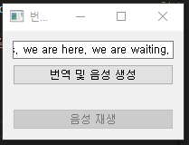
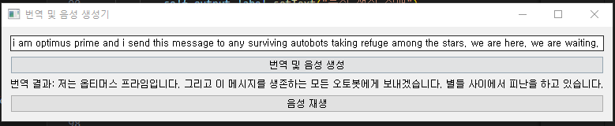

# 음성 생성, 번역 활용한 번역 서비스

- 영어 텍스트 입력받아 한국어로 번역. 해당 번역문을 한국어 음성으로 변환 및 재생하는 GUI 프로그램.

- PyQt5를 활용해 UI 구축. Facebook 번역 모델, ElevenLabs 음성 합성 API 활용.

- 주요 포인트

    1. Facebook 번역 모델 : NLLB 모델 활용, 다양한 언어 고정밀도로 번역.
    2. ElevenLabs API : 한국어 번역문 음성으로 변환, 한국어로 재생.
    3. PyQt5 UI 구성 : 사용자가 쉽게 영문 입력, 한국어 번역 및 음성 생성 시도 가능.

## 구현 기능

1. 번역 기능 : 영어 텍스트 입력받고 한국어로 번역
2. 음성 생성 기능 : 번역된 한국어 텍스트를 음성으로 변환
3. 음성 재생 기능 : 변환된 음성 재생
4. GUI 구성 : PyQt5 통해 입력 필드, 버튼, 텍스트 출력, 음성 재생 버튼 갖춘 UI 구성

## 구현

    1. 필요 라이브러리 임포트  

        - PyQt5 : GUI, 음성 재생 컨트롤에 사용
        - transformers : Facebook 번역 모델 사용, 영어 -> 한국어
        - pydub : 생성된 mp3 음성 재생
        - dotenv, requests : ElevenLabs의 음성 생성 API 호출 위한 환경변수, HTTP 요청 기능 제공

        ```python
        import os
        import requests
        from dotenv import load_dotenv
        from PyQt5 import QtWidgets
        from PyQt5.QtCore import QUrl
        from PyQt5.QtMultimedia import QMediaPlayer, QMediaContent
        from transformers import AutoTokenizer, AutoModelForSeq2SeqLM
        from pydub import AudioSegment
        from pydub.playback import play
        import io

        ```

    2. TranslatorApp 클래스 생성  

        - UI 초기화 : init_ui 메서드를 호출, GUI 구성 요소 설정.
        - 번역 모델 로드 : 페이스북의 'nllb-200-distilled-600M' 모델로 번역.
        - API 설정 : .env 파일에서 elevenlabs API 키와 url 불러옴.
        - 음성 재생기 초기화 : QMediaPlayer로 음성 재생 준비.
        - 저장 위치 생성 : 경로 설정, 파일 존재 시 그냥 진행.

        ```python
        class TranslatorApp(QtWidgets.QWidget):
            def __init__(self):
                super().__init__()
                self.init_ui()

                # 번역 모델 로드
                model_name = "facebook/nllb-200-distilled-600M"
                self.tokenizer = AutoTokenizer.from_pretrained(model_name)
                self.model = AutoModelForSeq2SeqLM.from_pretrained(model_name)

                # API 설정
                load_dotenv()
                self.api_key = os.getenv("API_KEY")
                self.url = os.getenv("API_URL")

                # 음성 재생기
                self.player = QMediaPlayer()

                # 저장할 위치 생성.
                self.output_audio_path = os.path.join("Use AI model/실습/app2/audio_output", "output_audio.mp3")
                os.makedirs("audio_output", exist_ok=True)
        ```

    3. UI 구성  

        - 입력 필드 : 영어 텍스트 입력 받는 QLineEdit.
        - 번역 버튼 : 번역 및 음성 생성 시작 버튼.
        - 결과 표시 라벨 : 번역된 한국어 텍스트 표시.
        - 재생 버튼 : 생성된 음성 재생, 번역과 음성 생성 후 활성화.

        ```python
            def init_ui(self):
            # UI 구성
                self.text_input = QtWidgets.QLineEdit(self)
                self.text_input.setPlaceholderText("번역할 텍스트 입력")
                self.translate_button = QtWidgets.QPushButton("번역 및 음성 생성", self)
                self.output_label = QtWidgets.QLabel(self)
                self.play_button = QtWidgets.QPushButton("음성 재생", self)
                self.play_button.setEnabled(False)

                # 레이아웃 설정
                layout = QtWidgets.QVBoxLayout()
                layout.addWidget(self.text_input)
                layout.addWidget(self.translate_button)
                layout.addWidget(self.output_label)
                layout.addWidget(self.play_button)
                self.setLayout(layout)

                # 버튼 클릭 시 이벤트 핸들러 연결
                self.translate_button.clicked.connect(self.translate_and_generate_audio)
                self.play_button.clicked.connect(self.play_audio)

                # 윈도우 창 설정
                self.setWindowTitle("번역 및 음성 생성기")
                self.show()
        ```
    
    4. translate_and_generate_audio : 번역 및 음성 생성

        - 번역 수행 : 입력된 영어 텍스트 토큰화, 번역 모델 통해 한국어 변환.
        - 번역 텍스트 음성 생성 요청 : ElevenLabs API 통해 한국어 텍스트 음성 생성.
        - 성공 여부 결과 표시 : 번역 결과 'output_label'에 표시.

        ```python
            def translate_and_generate_audio(self):
                text = self.text_input.text()

                # 번역 수행
                inputs = self.tokenizer(text, return_tensors="pt")
                generated_tokens = self.model.generate(inputs.input_ids, forced_bos_token_id=self.tokenizer.lang_code_to_id["kor_Hang"])
                translated_text = self.tokenizer.decode(generated_tokens[0], skip_special_tokens=True)

                # 음성 생성 요청
                data = {
                    "text": translated_text,
                    "model_id": "eleven_multilingual_v2",
                    "voice_settings": {
                        "stability": 0.5,
                        "similarity_boost": 1,
                        "style": 0.5,
                        "use_speaker_boost": True
                    }
                }
                headers = {
                    "xi-api-key": self.api_key,
                    "Content-Type": "application/json"
                }
                response = requests.post(self.url, json=data, headers=headers)

                if response.status_code == 200:
                    with open(self.output_audio_path, "wb") as f:
                        f.write(response.content)

                    self.output_label.setText(f"번역 결과: {translated_text}")
                    self.play_button.setEnabled(True)
                else:
                    self.output_label.setText("음성 생성 실패")
        ```

    5. play_audio - 음성 재생

        - 오디오 파일 확인 : 파일 존재할 경우 playsound 함수 통해 재생.
        - 파일 미존재 시 오류 표시 : 없으면 'output_labe'에 오류 메시지 표시.

        ```python
            def play_audio(self):
                # 음성 파일 재생
                if os.path.exists(self.output_audio_path):
                    playsound(self.output_audio_path)  # Pydub의 play() 함수 사용
                else:
                    self.output_label.setText("오디오 파일을 찾을 수 없습니다.")
        ```

    6. 메인 실행부

        - QAplication 실행 : PyQt5 GUI 앱 실행.
        - 이벤트 루프 : app.exec_() 통해 이벤트 루프 실행.

        ```python
        if __name__ == '__main__':
            app = QtWidgets.QApplication([])
            translator = TranslatorApp()
            app.exec_()

        ```
    
### 결과

- 실행 후 첫 화면  

- 번역할 문장 입력 후 '번역 및 음성 생성' 버튼 클릭

- 생성된 오디오  

